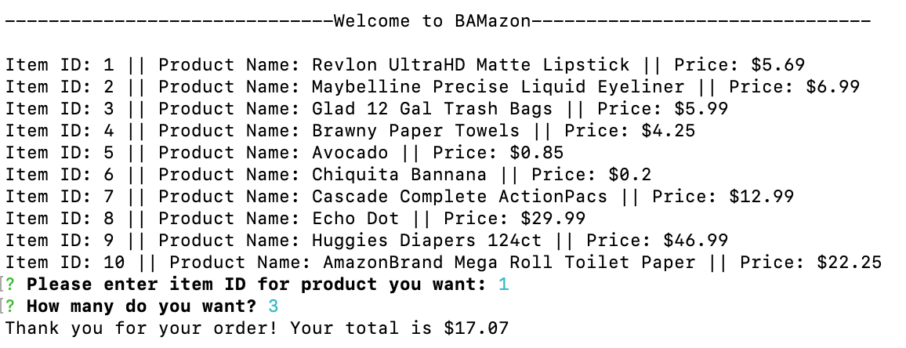

# BAMazon

## Description

* An interactive storefront that runs in the console using node. 

## How it works

**bamazonCustomer.js** -- This program consists of three seperate, but related apps. The first, BamazonCustomer.js, allows a "customer" to place an order from the Bamazon store. A check is then performed on the store inventory and the customer is either alerted that their order cannot be completed, or they are shown the total amount owed (but no credit card number is requested). Behind the scenes, the quantity ordered by the customer is deducted from the store quantity (which is stored in a SQL table). At the same time, the $ amount of the order is sent to seperate SQL table to allow the corportate executives to track earnings by department.

<kbd>
  
</kbd>

---------------------------------------------------------------------------------------

**bamazonManager.js** -- The second app, BamazonManager.js, allows a "manager" to view available items, view low inventory (less than five in stock), add to the inventory, or add a new product.
